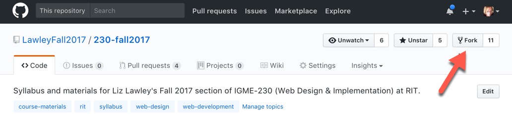

| [Previous Page: 1. GitHub Overview](aboutGithub.md) | [Back to Main Page](README.md) | [Next Page: 3. Slack Overview](aboutSlack.md) |
|--------------------------------|-----------------------------|------------------------|

# 2. Accessing Content on GitHub

If you're reading this, you're already using GitHub. Congratulations! 

This is as much "using GitHub" as your students will need to do. If it's a public repository, they don't even need a GitHub account to access the materials. I use a repo for the course materials in my [freshman survey class on Interactive Media], and we never talk at all about git or how to create or modify files in a repository--it's simply a server that I use to publish materials for my students. 

So, if all I'm doing is publishing read-only materials for students, why use GitHub rather than our university's learning management system? Because the LMS locks the content up so that only students currently registered for the class can access it, and my goal is to make my materials easily accessible to anyone who's interested in them. 

I often receive requests from students and colleagues at RIT who would like to see my course materials. Why?
- Students considering taking the class in the future might want to know what topics I cover. 
- Students who have taken the class in the past might want to see updated materials. 
- Faculty teaching the same class might want to use or modify my materials for their own section. 
It's a cumbersome process to add each interested person individually to a specific section of the course in the LMS, and make sure their permissions are set properly.

I also receive requests from people *outside* of RIT who are interested in my course materials, and there's no way at all for me to share materials from the LMS with them. These fall into several categories:
- Faculty members at other schools who are interested in reviewing my materials and possibly adapting them for their own use, something that I encourage (most of my materials are CC-licensed). 
- Alumni who no longer have accounts on the LMS, but want access to up-to-date versions of my materials and links.
- People who'd like to do one or more of the exercises or tutorials that I've posted, for their own learning. 

I could address most of those needs by simply putting my materials up on my university or personal website--which is what I actually did for years. In fact, back in 2004 I actually modified Movable Type (the most popular blogging platform before WordPress took over) as a courseware system, and even [published instructions](http://mamamusings.net/archives/2004/01/06/mt_courseware_stepbystep.php) that many other faculty used to set up their own course websites. If all I wanted to do was *publish* the materials, a simple website or blog would still work fine for that. 

However, I don't just want to *publish* my materials. I also want to invite others to copy them, modify them, and extend them--and then to share their additions and corrections back with me when they do. In other words, I want to treat my course materials like open source software! 

Let's take a look at the GitHub repos for the classes I'm teaching this semester--[Introduction to Interactive Media](https://github.com/LawleyFall2017/110-fall2017) and [Web Design & Implementation](https://github.com/LawleyFall2017/230-fall2017). You'll see that I use the repos to distribute my syllabus, schedule of topics and readings, in-class/homework exercises, and project assignments. What I *don't* use them for is anything that's private (and FERPA-protected)--classlists, grades, and discussions. The grade-related information, including online quizzes and dropboxes for assignments, are the only thing I still keep in the LMS. Discussions have all moved to Slack, which we'll talk about in a few minutes. 

Up in the top right corner of each of the repos, you can see something labeled "Fork". That shows you how many people have made copies of my repo on GitHub, so that they can change and/or extend it. Some of those are faculty members who are adapting my materials for their own use. Some are students who want a local copy of the course materials. 

When I'm teaching a class to students who have experience using GitHub, I invite them to help me fix errors that they find in my materials. If I've left out a step in an exercise, or there's a broken link in my readings, they can edit the file themselves and submit the changes for me to review and incorporate. It's a lot more efficient than asking them to email me suggested changes that I then have to hunt down in the materials! All they need to do that is an account on GitHub and a web browser. (In the ["Creating and Editing GitHub Content" section](creatingGithub.md), I'll walk through the process of how a student--or anyone else, including you!--would do this.)

The next step, of course, is creating your own repository of materials on GitHub. But before we go there, let's take a break from GitHub, and talk about Slack. I'll start with an overview of what Slack is and why I use it, and then I'll have you join a Slack workspace I've set up for this presentation so you can see it in action. If there's time, at the end of this presentation I'll also take you through the process of [creating your own Slack workspace](creatingSlack.md). 

| [Previous Page: 1. GitHub Overview](aboutGithub.md) | [Back to Main Page](README.md) | [Next Page: 3. Slack Overview](aboutSlack.md) |
|--------------------------------|-----------------------------|------------------------|

***This page is part of Liz Lawley's [Fork Your Syllabus, You Slacker! : A DML Teach-In, 6 October 2017](https://dml2017.sched.com/event/0f03a40b042cc1a6f4e73a78a62d0305)***
