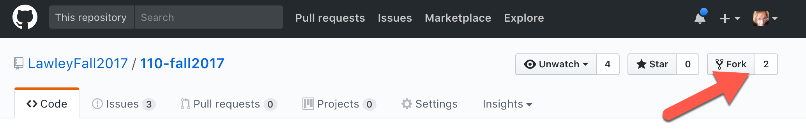
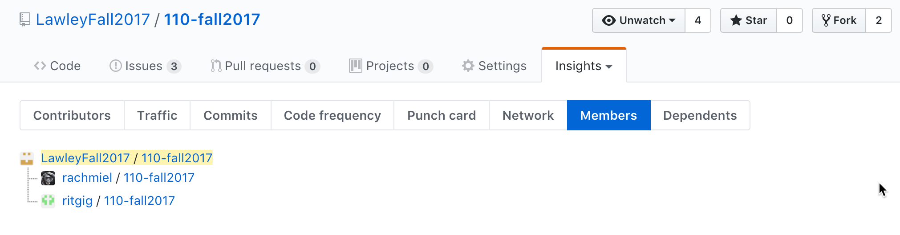
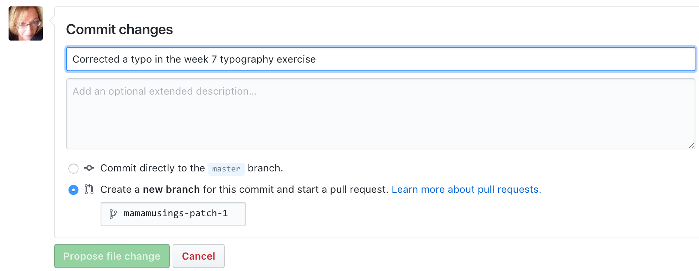

| [Previous: Using Slack](usingSlack.md) | [Main Page](README.md) | [Next: Creating a Slack Workspace](creatingSlack.md) |
|--------------------------------|-----------------------------|------------------------|

# Creating Content on GitHub

There are two basic ways to create content on GitHub. One is to make a copy of ("fork") an existing repository of content and modify that; the other is to create an entirely new repository with your own original content. 

GitHub has an excellent "Bootcamp" with articles describing the basics of each of these processes, so I'm not going to replicate that information here. 

- [Create a Repo](https://help.github.com/articles/create-a-repo/)
- [Fork a Repo](https://help.github.com/articles/fork-a-repo/)

# Public vs Private Repositories
Free GitHub accounts can only be used to create public rather than private repositories, which can be a problem if you're not ready to share your materials with the entire internet. However, GitHub [educational discounts](https://education.github.com) for both teachers and students that allow you to create unlimited private repositories. 

## Creating vs Forking Content
If there's already a repository of content that's similar to what you're trying to create, it probably makes sense to fork that repo and then modify it. If not, you'll need to create a new repository to house your content. 

Let's use my survey class as an example. I created that repository from scratch rather than forking my existing web design class repo, because the content is significantly different between the two classes. 

However, I have several colleagues who are teaching sections of the same course, and who wanted to build on what I'd already created. They used GitHub to "fork" my repository, which placed a copy of the files in their personal GitHub account. But GitHub doesn't just copy the files--it also keeps track of the connection between the original repository and your copy. On the original repo, you can see all copies that have been forked from it; on the forked copy, you can see a link back to the original. 

Here's an example of how that happened with [the course repo.  

If you look at the top of any page in [my course repo](https://github.com/LawleyFall2017/110-fall2017), you'll see an indicator telling you how many times the repository has been forked. There are two other people teaching sections of the same class this semester, and each of them has forked a copy of my repo. If you click on that number 2, you'll get more information about the network of connected repositories. 

There's a lot of information to unpack here, but for now we'll just look at the "Members" section, which shows you the two users who forked this repo, and provides links to their copies. 

My colleagues can then modify their copies for use in their own classes. If they make a change that they think I'd like to incorporate into my original--like correcting a typo, or adding a link to a new reading--they can do that by creating something called a "pull request." 

Why "pull" and not "push"? Because they don't have permission to push content into my repository. Instead, they save the changes to a "branch" of their own repository (a temporary copy in which you can store changes that you're not yet sure you want to incorporate into your own code), and then generate a request that asks me to pull that change into my own copy. I can choose to accept that request and incorporate their changes, or to reject it. 

In the session, I'll show you a few other examples of how pull requests work. 

Want to try forking a repository yourself? If you're logged into your GitHub account, you can click on the word "Fork" at the top of this page and it will make a copy of these workshop materials in your own GitHub account! You can then edit those materials in whatever way you'd like--you can even submit pull requests to incorporate changes into my repository!

## GitHub "Organizations"

You may have noticed that these course materials aren't in my [personal GitHub account](https://github.com/mamamusings)--they're in a GitHub organization called [LawleyWorkshops](https://github.com/LawleyWorkshops). And my fall 2017 class repositories are all in an organization called [LawleyFall2017](https://github.com/LawleyFall2017). 

Since GitHub doesn't allow you to create any organizational structure for repositories, organizations provide a way to group related content together. We won't have time to talk about organizations today, but if you start using GitHub on a regular basis, you may want to consider using organizations to group repositories for specific classes or semesters. If you do this, and want to include private repositories, you will also need to apply for an educational discount for each organization.   

| [Previous: Using Slack](usingSlack.md) | [Main Page](README.md) | [Next: Creating a Slack Workspace](creatingSlack.md) |
|--------------------------------|-----------------------------|------------------------|

***This page is part of Liz Lawley's [Fork Your Syllabus, You Slacker! : A DML Teach-In, 6 October 2017](https://dml2017.sched.com/event/0f03a40b042cc1a6f4e73a78a62d0305)***

