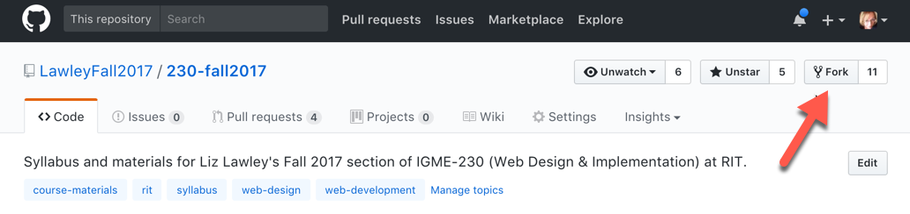

| [Previous: Using Slack](usingSlack.md) | [Main Page](README.md) | [Next: Creating a Slack Workspace](creatingSlack.md) |
|--------------------------------|-----------------------------|------------------------|

# Creating Content on GitHub

***Still under construction***

## Copying and Modifying an Existing Repo

Up in the top right corner of this repo, you can see something labeled "Fork". That shows you how many people have made their own copies of the course repo here on GitHub, so that they can change and/or extend it. This is a brand-new repo, so the number is likely to be very small right now. Some of those are faculty members who are adapting my materials for their own use. Some are students who want their own local copy of the course materials. (It's not surprising that there are more forks of my web development materials, since that's a class where we actually teach students how to use git and GitHub!)

When I'm teaching a class to students who have experience using GitHub, I invite them to help me fix any errors that they find in my materials. If I've left out a step in an exercise, or there's a broken link in my readings, they can edit the file themselves and submit the changes for me to review and incorporate. It's a lot more efficient than asking them to email me suggested changes that I then have to hunt down in the materials! All they need is an account on GitHub and a web browser. In fact, if you're logged into GitHub right now, you can do the same thing; I'll demo it in the session. 

## Creating a Completely New Repo 

There are two primary ways to provide non-code content on GitHub. One way is to use its built-in web page creation tools [(GitHub Pages)](https://pages.github.com/) to create a website with your content. I won't be covering that in this workshop. The other way, which is what I'll be showing (and what you're currently using), is creating human-readable documents directly in a repository by using a simple markup language called Markdown.

| [Previous: Using Slack](usingSlack.md) | [Main Page](README.md) | [Next: Creating a Slack Workspace](creatingSlack.md) |
|--------------------------------|-----------------------------|------------------------|

***This page is part of Liz Lawley's [Fork Your Syllabus, You Slacker! : A DML Teach-In, 6 October 2017](https://dml2017.sched.com/event/0f03a40b042cc1a6f4e73a78a62d0305)***

