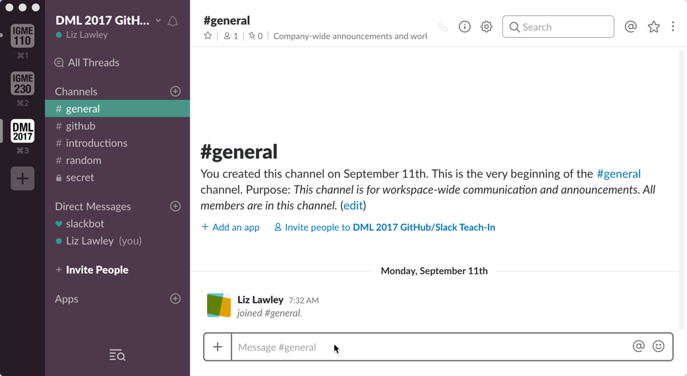

| [Previous: Using GitHub for Course Materials](usingGithub.md) | [Main Page](README.md) | [Next: Creating Your Own Content on GitHub](creatingGithub.md) |
|--------------------------------|-----------------------------|------------------------|

# 3. Using Slack

### Joining the Workshop Slack
The best way to understand how Slack works is to actually play around with it, so I've created a workspace for this workshop. Here's the invitation link to join it: http://links.lawley.net/joinDML (Because invitation links are a little unwieldy, I used a link shortener on my domain to redirect to the invitation; that also lets me replace the invitation URL with a new one if necessary.) 

Slack workspaces can be set up with a generic invitation link for joining (like this one), which has an expiration date (in this case, October 9th). You can also generate individual invitations to specific email addresses. And finally, you can configure them allow anyone with an email address in a specific domain to join, which is what I use for my classes. 

You'll be able to return to the workspace in the future by using this URL rather than the invite link: https://dml2017-lawley.slack.com/ (keep in mind, however, that I generally don't stay logged into Slacks from past classes and events, so while it's a fine way to explore the features, it won't be a good way to reach me directly). 

>If you already use Slack with another group or project, be aware that every Slack workspace is a completely separate instantiation--a login on one Slack workspace can't be used on any other workspace. This can also be confusing for students who are already using Slack for other purposes. You can be logged into different workspaces in different tabs on the same browser, though, and all of the Slack clients allow you to be logged into multiple workspaces. 

Here's what my Mac desktop client looks like when I'm logged into the workspaces for both of my current classes and the one for this workspace:

I've done only a small amount of customization on this workspace. Click on the  **Channels** heading (the word itself, not the plus sign), to see a list of available channels in the workspace. In addition to the two channels (\#general and \#random) that are created by default in a new workspace, there should be two additional channels visible to you: \#introductions and \#github. Go ahead and join the \#introductions channel, and post a brief intro there. 

After you've posted your intro, take a look at the \#github channel. This is an example of a Slack integration. I've set it up so that every time I send changes to the GitHub repo for the workshop, that information is automatically posted to this channel. In my classes, this lets students see if and when I've made changes to the syllabus or assignments--and what the short description of those changes are. 

Finally, try creating a new channel by clicking on the +. If you make a public channel, anybody with an account on the workspace can join it. If you make a private channel, you'll need to invite people before they can see it exists. Private channels that you belong to show up in the channel list with a "lock" icon next to them. 

Feel free to also send me a direct (private) message--I probably won't respond until after the presentation is over, however!

## How I Use Slack in the Classroom

Getting students to use new communication tools can be a challenge, and the first time I tried using Slack in the classroom it wasn't as successful as I'd hoped. Since then, I've started doing a number of things to increase its use by my students. 

For privacy reasons, I can't give you a live tour of my class workspaces, but I've created anonymized screenshots to illustrate my techniques.

### Announcements Channel
I renamed the default \#general channel to \#announcements, and set it so that only my TAs and I can post to it. I use it let them know about useful things, like upcoming deadlines, extensions on due dates, and why I might be a few minutes late for class; that gives them a good reason to set up the mobile client and enable notifications. And because nobody else can post there, they don't mind turning notifications on for that channel. 

- I create some informal channels that they find engaging--like a music suggestions channel where they can post songs they'd like me to add to the class playlist (which I play on in the background when they're working on in-class exercises). 
- Early in the semester I assign an exercise that requires them to post to the \#introductions channel, so I can be sure they've set up an account and figured out how to join a channel. 
- There are a few things I tell them I will only respond to via Slack--for instance, if I offer an opportunity for them to resubmit a project with a low grade, I'll say they need to contact me via Slack to request that I regrade the new version.
- Most importantly, I've made a commitment to respond quickly to student messages. The way I've managed this without getting overwhelmed is to check notifications several times a day and quickly acknowledge any incoming messages--but to mark messages for later response if it's not something that can be immediately responded to. At the end of the day, I take the time to go through and respond to the marked messages. 
- Oh...and I've added a link to the Slack workspace in the main navigation of the class in the LMS (along with a link to the class GitHub repo). 

I have not stopped using email for communicating with students, of course. Anything that I need a "paper trail" on--warnings about grades, requests to meet with them in my office hours, etc--still gets sent by email. And a student can be perfectly successful in my class without ever using Slack beyond the initial introduction assignment. 

Ideally, though, I want them to see Slack as a good way to ask questions, make comments, and get help. I've found that once I get them over the adoption hump, they really appreciate its informality and ephemerality, and I get far more opportunities to hear from students who have questions or concerns than I did in the past. 

| [Previous: Using GitHub for Course Materials](usingGithub.md) | [Main Page](README.md) | [Next: Creating Your Own Content on GitHub](creatingGithub.md) |
|--------------------------------|-----------------------------|------------------------|

***This page is part of Liz Lawley's [Fork Your Syllabus, You Slacker! : A DML Teach-In, 6 October 2017](https://dml2017.sched.com/event/0f03a40b042cc1a6f4e73a78a62d0305)***
