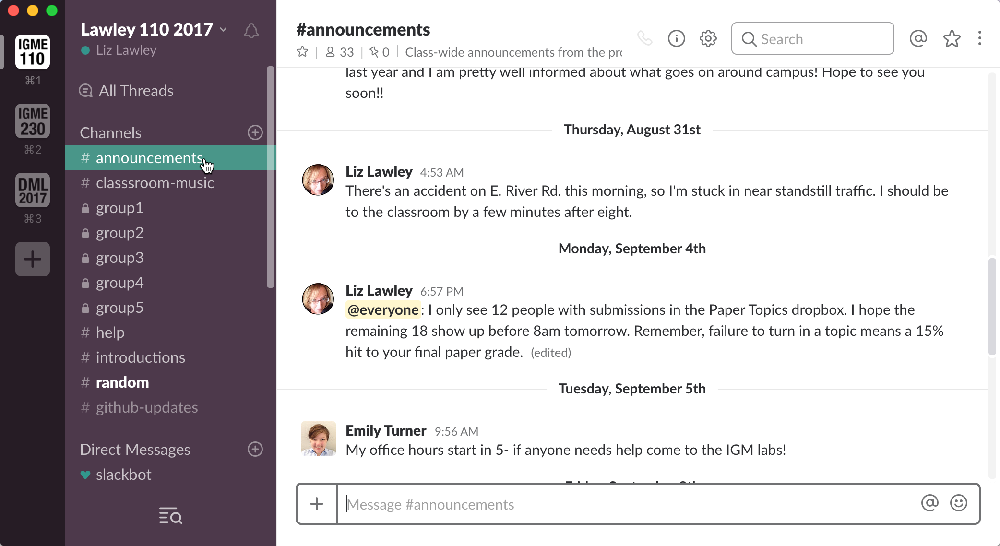
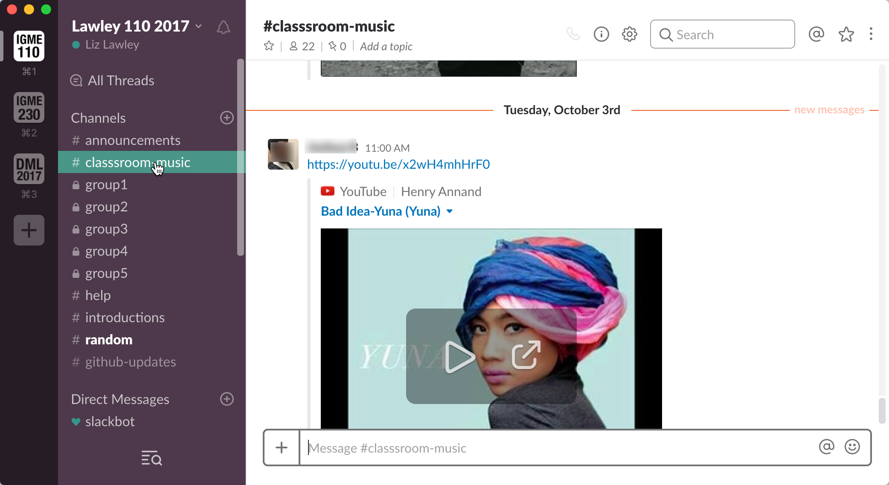
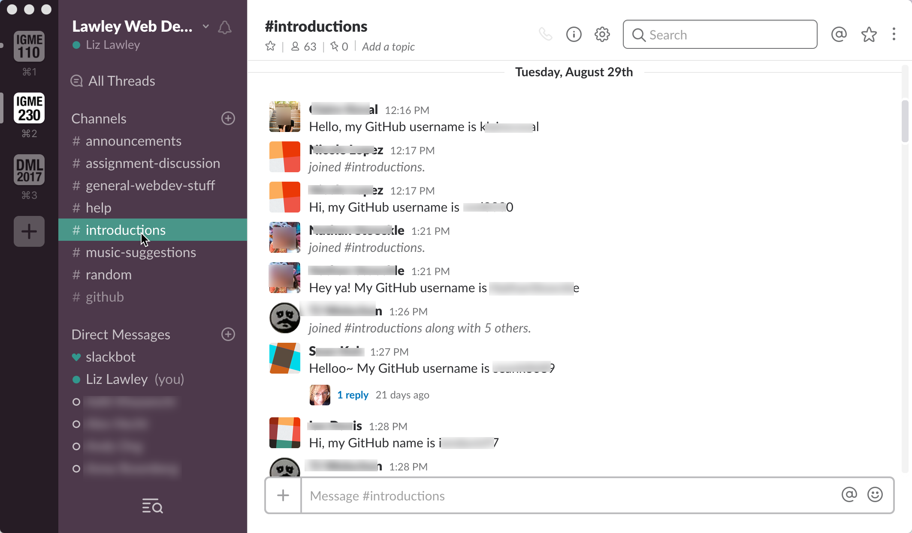
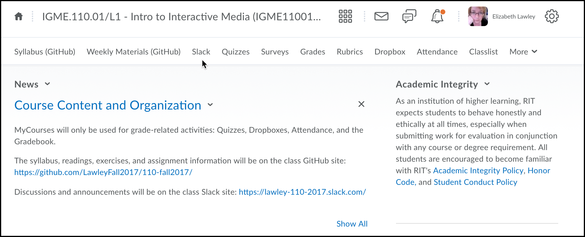
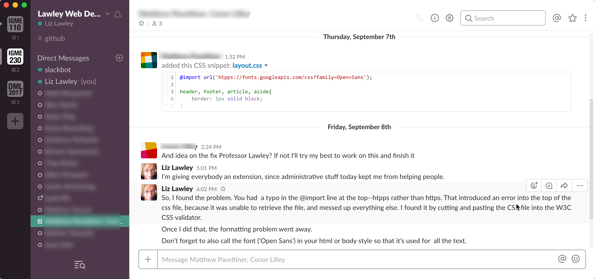

| [Previous: Using GitHub for Course Materials](usingGithub.md) | [Main Page](README.md) | [Next: Creating Your Own Content on GitHub](creatingGithub.md) |
|--------------------------------|-----------------------------|------------------------|

# 3. Using Slack for a Course

Many LMS systems provide group and private chat options now, and our students certainly don't lack for real-time communication tools to talk to us and each other. So why add another tool to the mix? And why Slack in particular?

- RIT is a co-op education school, which means our students go out on semester-long work experiences several times during their degree. Many of them will end up at companies using Slack, so this gives them hands-on experience with an important productivity tool.
- Slack has excellent mobile clients, which is typically the very best way to reach my students. (As we all know, email is pretty low on the list of ways to get your students' attention quickly.)
- Slack's integrations, especially with Google Docs, GitHub, and Trello, are extremely useful in my classes, where those services are also an important part of the instructional technology used. 
- Slack makes it easy for students to upload the files they want me to look at, and displays/formats code snippets as well
- I can easily create private group chat channels for student groups, and be a member of those channels, which helps greatly in assessing ongoing participation and group dynamics issues
- It's easy for me to add external people to a Slack workspace, which comes in handy when I've got a class working on a project with outside experts. 

One of the biggest drawbacks of using any type of real-time messaging with active groups, of course, is that it can turn into a major source of productivity-killing interruptions. That's why for years I've avoided using it for most work-related activities. However, when I use it with students, it allows me prioritize their questions over the mountains of less important (but still non-spam) email I get every day. To keep that under control, however, the *only* Slack workspaces I check regularly are the ones for my currently active classe--and once the term is over, I stop checking the workspaces entirely. (I'll still respond to former students' questions, of course, but they do lose their "priority access" to me. ) 

Getting students (or any group!) to adopt new communication tools can be a challenge, and the first time I tried using Slack in the classroom it wasn't as successful as I'd hoped. Since then, I've started doing a number of things to increase its use my students. 

For privacy reasons, I can't give you a live tour of my class workspaces, but I've created anonymized screenshots to illustrate some of my approaches.

### Announcements Channel
I renamed the default \#general channel to \#announcements, and set it so that only my TAs and I can post to it. I use it let them know about useful things, like upcoming deadlines, extensions on due dates, and why I might be a few minutes late for class; that gives them a good reason to set up the mobile client and enable notifications. And because nobody else can post there, they don't mind turning notifications on for that channel. 

### Inviting Information Engagement
I create some non-classwork channels that invite participation--this semester I created a music suggestions channel where they can post songs they'd like me to add to the class playlist (which I play on in the background when they're working on in-class exercises). 

### Requiring an Introduction
Early in the semester I assign an exercise that requires them to post to the \#introductions channel, so I can be sure they've set up an account and figured out how to join a channel. In my web class, I also use this as a way to collect their GitHub usernames, which I need later in the term. 

### Slack-Only Opportunities
There are a few things I tell them I will only respond to via Slack--for instance, if I offer an opportunity for them to resubmit a project with a low grade, I'll say they need to contact me via Slack to request that I regrade the new version.

### Easy Access to Slack (and GitHub) from LMS
Our LMS (Brightspace, formerly D2L, makes it possible to customize the navigation bar for a class, and to include custom links. I added links to both the GitHub repo and the Slack workspace from that, as well as adding a prominent "news" item on the first page with links to both. 

### Committment to Quick Responses
Most importantly, I've made a commitment to respond quickly to student messages. The way I've managed this without getting overwhelmed is put the Slack client on my phone's home screen. I check for new notifications several times a day, and quickly acknowledge any incoming messages--but if it's not something that can be immediately responded to, I let them know I'll get back to them, and I mark it with a star for later access. At the end of the day, I take the time to go through and respond to the marked messages. 

(The example below also shows how easy it is for them to share code with me in their messages.)

I have not stopped using email for communicating with students, of course. Anything that I need a "paper trail" on--warnings about grades, requests to meet with them in my office hours, etc--still gets sent by email. And a student can be perfectly successful in my class without ever using Slack beyond the initial introduction assignment. 

Ideally, though, I want them to see Slack as a good way to ask questions, make comments, and get help. I've found that once I get them over the adoption hump, they really appreciate its informality and ephemerality, and I get far more opportunities to hear from students who have questions or concerns than I did in the past. 

| [Previous: Using GitHub for Course Materials](usingGithub.md) | [Main Page](README.md) | [Next: Creating Your Own Content on GitHub](creatingGithub.md) |
|--------------------------------|-----------------------------|------------------------|

***This page is part of Liz Lawley's [Fork Your Syllabus, You Slacker! : A DML Teach-In, 6 October 2017](https://dml2017.sched.com/event/0f03a40b042cc1a6f4e73a78a62d0305)***
